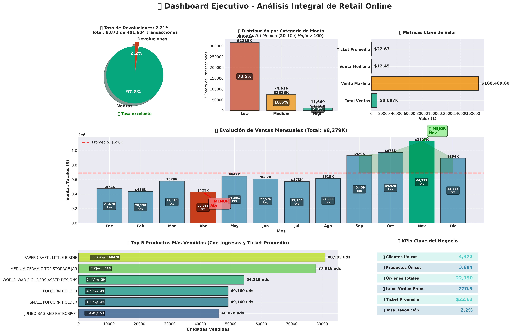
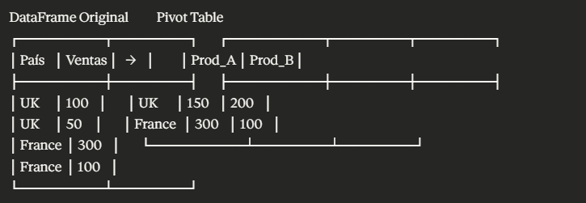

# 🛒 Proyecto: Análisis de Retail Online

Análisis completo end-to-end de un dataset real de e-commerce con más de 500K transacciones.

## 📊 Información del Dataset

- **Fuente:** Online Retail Dataset (UCI Machine Learning Repository)
- **Período:** Diciembre 2010 - Diciembre 2011
- **Registros originales:** 541,909 transacciones
- **Registros después de limpieza:** 401,604 (74.11% retención)
- **Variables:** InvoiceNo, StockCode, Description, Quantity, InvoiceDate, UnitPrice, CustomerID, Country

## 🎯 Objetivos del Proyecto

1. ✅ Aplicar técnicas de limpieza de datos
2. ✅ Realizar análisis exploratorio (EDA) completo
3. ✅ Identificar patrones estacionales en ventas
4. ✅ Validar el Principio de Pareto
5. ✅ Crear dashboards ejecutivos con insights accionables

## 🔍 Metodología

### Fase 1: Limpieza de Datos
```python
# Proceso aplicado:
- Eliminación de 5,268 duplicados (0.97%)
- Remoción de 140,305 registros sin CustomerID (25.89%)
- Validación de tipos de datos
- Creación de columna Total_Amount
- Identificación de devoluciones (Quantity < 0)
```

### Fase 2: Feature Engineering
```python
# Nuevas variables creadas:
- Total_Amount = Quantity × UnitPrice
- Year, Month, Semestre (desde InvoiceDate)
- Amount_Category (Low/Medium/High)
- Is_Return (flag de devoluciones)
```

### Fase 3: Análisis Exploratorio
- Distribución de ventas por mes y año
- Análisis de estacionalidad
- Cálculo de métricas clave (CSAT, ticket promedio)
- Identificación de productos top
- Curva de Pareto

### Fase 4: Visualizaciones
- Dashboard ejecutivo integrado
- Gráficos de patrones mensuales
- Análisis de performance
- Heatmaps y distribuciones

## 📈 Resultados e Insights

### 💰 Métricas Clave de Negocio

| Métrica | Valor |
|---------|-------|
| **Ventas Totales** | $8,279,144 |
| **Ticket Promedio** | $22.63 |
| **Venta Mediana** | $12.45 |
| **Venta Máxima** | $168,469.60 |
| **Clientes Únicos** | 4,372 |
| **Productos Únicos** | 3,084 |
| **Órdenes Totales** | - |

### 🔄 Calidad Operacional

- **Tasa de Devoluciones:** 2.21% ✅
  - Solo 8,872 de 401,604 transacciones
  - Excelente indicador de calidad del producto y servicio
  - Impacto financiero: Mínimo

### 📅 Análisis de Estacionalidad

**Mejor Mes:**
- Noviembre: $1,127K (+40% vs promedio)
- Temporada de compras navideñas

**Peor Mes:**
- Abril: $425K (-39% vs promedio)
- Oportunidad de campañas promocionales

**Brecha:**
- Diferencia: $702K (165%)
- Alta variabilidad estacional

### 🎯 Principio de Pareto Validado

- **20% de productos** → **78.81% de ventas** ✅
- Total de 3,084 productos
- Top 5 productos concentran ventas significativas
- **Recomendación:** Optimizar inventario de productos Pareto

### 💳 Distribución por Categoría de Monto

| Categoría | % Transacciones | Cantidad |
|-----------|----------------|----------|
| **Low (<$20)** | 78.5% | 315,266 |
| **Medium ($20-$100)** | 18.6% | 74,616 |
| **High (>$100)** | 2.9% | 11,669 |

**Insight:** 
- Alta concentración en tickets bajos
- Oportunidad de **upselling** y **cross-selling**

## 🛠️ Stack Tecnológico Usado
```python
import pandas as pd
import numpy as np
import matplotlib.pyplot as plt
import matplotlib.gridspec as gridspec
```

## 📂 Estructura del Proyecto
```
04_proyecto_retail_analysis/
├── data/
│   ├── raw/
│   │   └── online_retail.csv              # Dataset original
│   └── processed/
│       └── online_retail_clean.csv        # Datos limpios
├── notebooks/
│   └── 25_Analisis_datos_portafolio_final.ipynb  # Análisis completo
├── src/
│   ├── data_loader.py                     # Carga de datos
│   └── etl_retail_data.py                 # Pipeline ETL
├── reports/
│   ├── dashboard_ejecutivo_mejorado.png   # Dashboard principal
│   └── pd_pivot_tables.png                # Tablas dinámicas
├── 08_ejercicio_platzi_ventas.md          # Ejercicio guiado
├── 09_ejercicio_numpy_inventario.md       # Ejercicio complementario
└── README.md
```

## 🚀 Cómo Ejecutar el Proyecto
```bash
# 1. Instalar dependencias
pip install pandas numpy matplotlib jupyter

# 2. Navegar al directorio
cd 04_proyecto_retail_analysis/

# 3. Iniciar Jupyter
jupyter notebook notebooks/25_Analisis_datos_portafolio_final.ipynb

# 4. Ejecutar todas las celdas
```

## 💡 Recomendaciones de Negocio

### Prioridad Alta
1. **Reducir brecha estacional:**
   - Implementar campañas en meses débiles (Febrero, Abril)
   - Promociones fuera de temporada

2. **Impulsar tickets altos:**
   - 78% de ventas son <$20
   - Estrategias de upselling y bundles

### Prioridad Media
3. **Mantener calidad:**
   - Tasa de devolución excelente (2.21%)
   - Continuar con estándares actuales

4. **Enfoque en productos Pareto:**
   - Optimizar inventario de top 20%
   - Garantizar disponibilidad

### Oportunidades
5. **Análisis de clientes:**
   - Segmentar por comportamiento
   - Programas de fidelización

6. **Expansión geográfica:**
   - Analizar países con mayor potencial
   - Localizar ofertas

## 📸 Visualizaciones Destacadas

### Dashboard Ejecutivo


*Dashboard integral con 6 cuadrantes: Devoluciones, Categorías, Métricas clave, Evolución mensual, Top productos y KPIs*

### Análisis de Pivot Tables


*Análisis detallado con tablas dinámicas*

## 🎓 Aprendizajes Clave

### Técnicas Aplicadas
- ✅ Limpieza de datos con criterios de calidad
- ✅ Feature engineering para análisis temporal
- ✅ Análisis de Pareto para priorización
- ✅ Visualizaciones ejecutivas con GridSpec
- ✅ Storytelling con datos

### Habilidades Desarrolladas
- ✅ Pandas avanzado (groupby, pivot_table, merge)
- ✅ NumPy para cálculos eficientes
- ✅ Matplotlib para dashboards profesionales
- ✅ Pensamiento crítico en análisis de datos
- ✅ Comunicación de insights

## 📝 Próximos Pasos

- [ ] Análisis de cohortes de clientes
- [ ] Predicción de demanda con machine learning
- [ ] Análisis de canasta de productos
- [ ] Dashboard interactivo con Plotly/Dash
- [ ] Automatización de reportes

## 🤝 Contribuciones

Este proyecto es parte de mi portafolio de Data Science. Si tienes sugerencias o mejoras, ¡son bienvenidas!

---

**Proyecto completado:** Octubre 2025  
**Autor:** [Tu nombre]  
**LinkedIn:** [Tu perfil]

---

[← Volver al módulo de Data Science](../README.md)